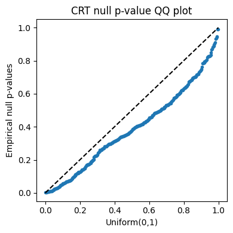
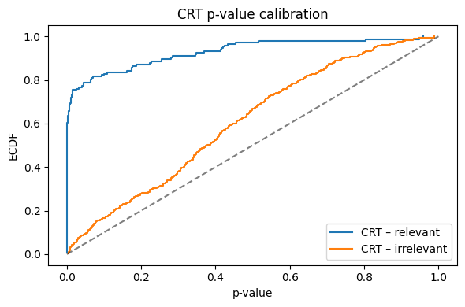

# TabPFN-CRT

This repository provides a research prototype for performing feature-level hypothesis testing
with foundation models using a Conditional Randomization Test (CRT).
The implementation treats TabPFN as a fixed predictive model and uses its predictive
log-likelihood to construct a valid test statistic.

The goal is to bridge modern foundation models with classical confirmatory inference,
particularly in settings where p-values and formal hypothesis tests are required.

----------------------------------------------------------------------
Motivation
----------------------------------------------------------------------

Foundation models such as TabPFN are increasingly used in applied research, but their
adoption in hypothesis-driven and feature-selection workflows is often limited by the
absence of principled statistical tests.

Many scientific disciplines still require:
- calibrated p-values
- explicit null hypotheses
- interpretable feature relevance decisions

This repository demonstrates how Conditional Randomization Testing (CRT) can be combined
with TabPFN outputs to provide valid feature-level inference without retraining or
modifying the underlying model.

----------------------------------------------------------------------
Method Overview
----------------------------------------------------------------------

Given data (X, y) and a feature index j, the procedure:

1. Fits a TabPFN model to predict y | X
2. Fits a separate TabPFN model to approximate the conditional distribution X_j | X_-j
3. Computes a test statistic based on the average log predictive density of y
4. Generates a null distribution by resampling X_j from its conditional distribution
5. Computes a right-tailed p-value via the Conditional Randomization Test

Crucially:
- TabPFN is treated as a fixed predictive model
- No Bayesian correctness or uncertainty calibration is assumed
- Validity relies on the CRT framework, not on TabPFN being probabilistically correct

----------------------------------------------------------------------
Empirical Validation
----------------------------------------------------------------------

We provide preliminary empirical results illustrating the calibration
properties of the TabPFN-based Conditional Randomization Test.

**Figure 1.** QQ plot of empirical CRT p-values under the null hypothesis
against the Uniform(0,1) distribution. Approximate alignment with the
diagonal indicates proper Type I error control.

**Figure 2.** Empirical CDFs of CRT p-values for relevant and irrelevant
features. P-values for irrelevant features are approximately uniform,
while relevant features exhibit strong left-skew, indicating power.

These results are intended as sanity checks rather than exhaustive
benchmarks. Theoretical validity of the procedure follows from the CRT
framework; empirical performance depends on the quality of the
conditional model for X_j | X_-j.

----------------------------------------------------------------------
Scope and Limitations
----------------------------------------------------------------------

- This is research code, not a production library
- The categorical/continuous distinction is heuristic
- Validity depends on how well X_j | X_-j is approximated
- Intended for methodological exploration, not automated large-scale testing

This repository is not an official TabPFN extension.

----------------------------------------------------------------------
Installation
----------------------------------------------------------------------

Install dependencies:

    pip install numpy torch scikit-learn tabpfn

Clone the repository:

    git clone https://github.com/<your-username>/tabpfn-crt.git
    cd tabpfn-crt

----------------------------------------------------------------------
Basic Usage
----------------------------------------------------------------------

Example:

    from tabpfn_crt import tabpfn_crt

    result = tabpfn_crt(
        X,
        y,
        j=3,
        B=200,
        alpha=0.05,
    )

    print(result["p_value"], result["reject_null"])

Returned values include:
- p_value
- reject_null
- observed test statistic
- null distribution
- feature and model metadata

----------------------------------------------------------------------
Repository Structure
----------------------------------------------------------------------

    tabpfn-crt/
    ├── tabpfn_crt/
    │   ├── crt.py
    │   ├── utils.py
    │   └── __init__.py
    ├── experiments/
    │   └── demo_*.py
    ├── paper/
    │   └── draft_white_paper.pdf
    └── README.md

----------------------------------------------------------------------
Relation to Prior Work
----------------------------------------------------------------------

This implementation follows the Conditional Randomization Test framework
(e.g., Candès et al., 2018) and adapts it to modern foundation models by:

- using predictive log-likelihood as the test statistic
- allowing flexible conditional modeling via TabPFN
- avoiding retraining or model modification

----------------------------------------------------------------------
Disclaimer
----------------------------------------------------------------------

This code is provided for research and educational purposes only.
It is not an official TabPFN tool and should not be interpreted as providing
causal guarantees.

----------------------------------------------------------------------
Contact
----------------------------------------------------------------------

Questions, feedback, or collaboration inquiries are welcome.
